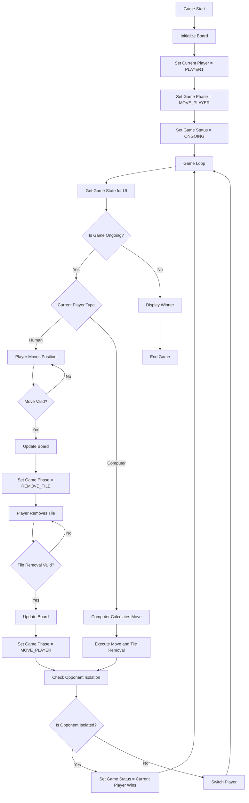

# Isola Game State Workflow

## Mermaid Diagram

## State Transition Explanation

1. **Game Initialization**:
   - Board is set up with players in starting positions
   - Current player is set to PLAYER1
   - Game phase is set to MOVE_PLAYER
   - Game status is set to ONGOING

2. **Human Player Turn**:
   - UI gets game state and sees it's human player's turn
   - UI enables player movement controls
   - Player moves their piece to a new position
   - Game phase transitions to REMOVE_TILE
   - UI enables tile removal controls
   - Player removes a tile
   - Game phase transitions back to MOVE_PLAYER
   - Check if opponent is isolated (game end condition)
   - If game not ended, switch to next player

3. **Computer Player Turn**:
   - UI gets game state and sees it's computer player's turn
   - Computer calculates and executes both move and tile removal
   - Check if opponent is isolated (game end condition)
   - If game not ended, switch to next player

4. **Game End**:
   - When a player is isolated, game status is updated to reflect winner
   - UI gets game state and displays victory message