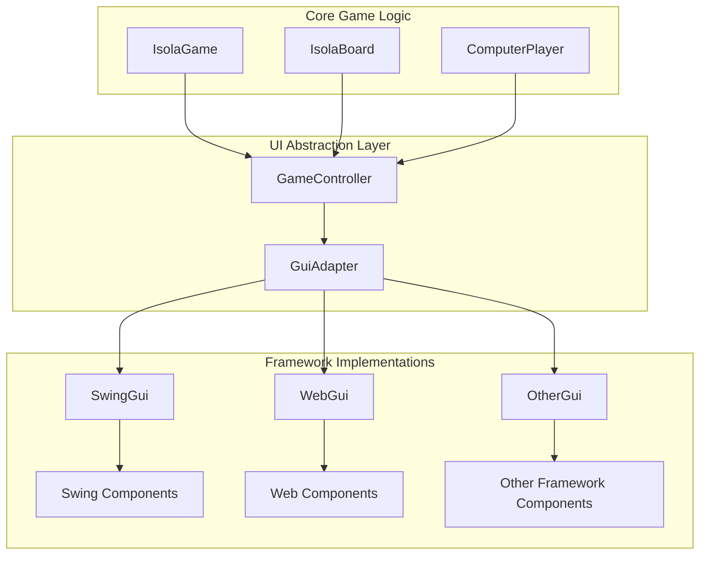

# Isola Game GUI Architecture

## Overview

This document describes the architecture for the Isola Game GUI, designed to support multiple GUI frameworks (Swing, Web, etc.) while maintaining a clean separation between game logic and UI implementation.

## Architecture Diagram



## Package Structure

```
src/
└── de/
    └── greenoid/
        └── game/
            └── isola/
                ├── gui/
                │   ├── adapter/
                │   ├── swing/
                │   ├── web/
                │   └── common/
                ├── board/
                ├── player/
                └── game/
```

## Component Descriptions

### GameController
- Acts as the intermediary between the core game logic and the GUI
- Manages game state updates and user interactions
- Handles communication with the GUI adapter

### GuiAdapter
- Abstracts the GUI implementation from the game logic
- Provides a common interface for different GUI frameworks
- Handles conversion between game state and UI representations

### SwingGui
- Swing-specific implementation of the GUI
- Contains all Swing components and event handlers
- Renders the game board and handles user interactions

### WebGui
- Web-based implementation (for future development)
- Could use HTML/CSS/JavaScript or a framework like React

## Key Design Principles

1. **Separation of Concerns**: Game logic is completely separated from UI implementation
2. **Extensibility**: New GUI frameworks can be added without modifying existing code
3. **Reusability**: Core game logic can be used with any GUI implementation
4. **Maintainability**: Changes to game logic or UI implementation can be made independently